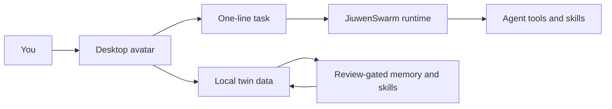

<div align="center">

# JiuMe

Your local-first desktop twin for personal agents.

[](https://github.com/XiaoLuoLYG/jiume/actions/workflows/ci.yml)
[](https://www.python.org/)
[](LICENSE)


</div>

JiuMe turns a personal agent into a small desktop companion: an always-on avatar, a one-line task box, local twin memory, mounted personal skills, and a review step before anything durable is learned.

It is intentionally local-first. You can open the app without cloud credentials, keep twin data on your machine, and decide when optional model or image providers are connected.

## Why People Try It

- **One-line daily loop**: click the avatar, type one task, and let the agent work.
- **Desktop-native feel**: the everyday surface is an avatar, not another busy dashboard.
- **Local twin data**: profile, avatar assets, memories, permissions, and audit logs live under `~/.jiuwenswarm/jiume/`.
- **Review before learning**: JiuMe can distill useful context into memory or personal skills, but durable writes stay user-approved.
- **Built on a real agent runtime**: JiuMe uses JiuwenSwarm instead of faking backend actions.

## Screenshots

These screenshots are generated from the current JiuMe desktop UI renderer with a temporary local twin. No cloud provider is required.


## Start From Zero

You need Python 3.11+ and `uv`.

```bash
git clone https://github.com/XiaoLuoLYG/jiume.git
cd jiume

uv venv --python 3.11 --seed .venv
uv pip install -e ".[test]"

.venv/bin/jiume-launch --open-setup
```

What should happen:

1. The setup page opens.
2. The local JiuwenSwarm runtime starts.
3. The JiuMe desktop avatar appears.
4. You can click the avatar and send a one-line task.

No API key is required for the first local run. If you later want generated avatars or hosted model providers, add credentials in Setup or export:

```bash
export JIUME_OPENAI_API_KEY="..."
export JIUME_OPENAI_BASE_URL="https://api.openai.com/v1"
export JIUME_IMAGE_MODEL="gpt-image-2"
export JIUME_IMAGE_PROVIDER="auto"
```

For a UI-only smoke test:

```bash
.venv/bin/jiume --gateway-url ""
```

## Core Architecture



The only idea you need first: JiuMe is the friendly desktop layer; JiuwenSwarm is the agent runtime; your twin data stays local unless you explicitly connect outside services.

## Project Map

```text
jiume/                    JiuMe product layer
  desktop/                avatar window, task capsule, local desktop state
  setup/                  first-run setup and settings server
  runtime/                bridge into JiuwenSwarm
  twins/                  local profile, memory, permissions, audit data
  skills/                 personal skill catalog helpers
  personal_distillation/  review-gated learning pipeline
  avatar/                 avatar assets and manifests
jiuwenswarm/              underlying agent runtime
tests/unit_tests/jiume/   focused JiuMe tests
docs/en/JiuMe.md          practical English guide
docs/zh/JiuMe.md          practical Chinese guide
```

## Developer Check

```bash
.venv/bin/python -m compileall -q jiume jiuwenswarm/start_services.py
.venv/bin/python -m pytest -q --no-cov tests/unit_tests/jiume
git diff --check
```

## Learn More

- [Chinese README](README_CN.md)
- [JiuMe practical guide](docs/en/JiuMe.md)
- [Contribution guide](CONTRIBUTING.md)
- [Security policy](SECURITY.md)
- [Support](SUPPORT.md)

## Contributing

Contributions are welcome when they make the local experience clearer, safer, or more useful. Please keep user-facing claims grounded in real behavior and read [CONTRIBUTING.md](CONTRIBUTING.md) before opening a pull request.

## License

JiuMe is released under the [Apache License 2.0](LICENSE).
