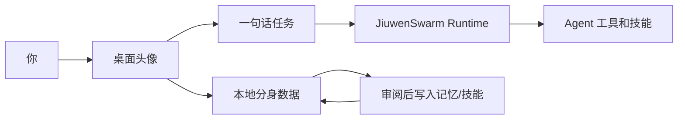

<div align="center">

# JiuMe

本地优先的个人 Agent 桌面分身。

[](https://github.com/XiaoLuoLYG/jiume/actions/workflows/ci.yml)
[](https://www.python.org/)
[](LICENSE)


</div>

JiuMe 把个人 Agent 变成一个常驻桌面的轻量分身：一个头像入口、一句话任务框、本地分身记忆、可挂载的个人技能，以及任何持久学习前的用户确认。

它刻意保持本地优先：没有云端凭证也能打开体验；分身档案、头像资产、记忆、权限和审计日志默认保存在你自己的机器上；外部模型或图片服务需要你显式连接。

## 为什么值得试

- **一句话日常循环**：单击头像，输入一句任务，让 Agent 继续处理。
- **桌面原生感**：日常界面是一个头像，而不是又一个复杂控制台。
- **本地分身数据**：profile、avatar assets、memories、permissions 和 audit logs 位于 `~/.jiuwenswarm/jiume/`。
- **先审阅再学习**：JiuMe 可以把有用上下文沉淀成记忆或个人技能，但持久写入需要用户确认。
- **真实 Agent Runtime**：JiuMe 复用 JiuwenSwarm，不用假的后端动作糊弄体验。

## 截图

这些是仓库内置的静态产品预览，用来帮助新用户快速理解当前 MVP 的界面方向。运行本地应用后可以看到真实 UI。


## 从零开始

你需要 Python 3.11+ 和 `uv`。

```bash
git clone https://github.com/XiaoLuoLYG/jiume.git
cd jiume

uv venv --python 3.11 --seed .venv
uv pip install -e ".[test]"

.venv/bin/jiume-launch --open-setup
```

正常情况下你会看到：

1. Setup 页面打开。
2. 本地 JiuwenSwarm Runtime 启动。
3. JiuMe 桌面头像出现。
4. 你可以单击头像并发送一句话任务。

第一次本地运行不需要 API Key。之后如果想接入生成头像或托管模型，可以在 Setup 里填写，也可以导出环境变量：

```bash
export JIUME_OPENAI_API_KEY="..."
export JIUME_OPENAI_BASE_URL="https://api.openai.com/v1"
export JIUME_IMAGE_MODEL="gpt-image-2"
export JIUME_IMAGE_PROVIDER="auto"
```

如果只想离线查看头像 UI：

```bash
.venv/bin/jiume --gateway-url ""
```

## 核心架构



先记住这一点就够了：JiuMe 是更友好的桌面层；JiuwenSwarm 是真实 Agent Runtime；你的分身数据默认留在本地，除非你明确接入外部服务。

## 项目结构

```text
jiume/                    JiuMe 产品层
  desktop/                头像窗口、任务胶囊、本地桌面状态
  setup/                  首次配置和设置服务
  runtime/                接入 JiuwenSwarm 的桥接层
  twins/                  本地档案、记忆、权限、审计数据
  skills/                 个人技能目录辅助
  personal_distillation/  需要审阅的学习流水线
  avatar/                 头像资产和 manifest
jiuwenswarm/              底层 Agent Runtime
tests/unit_tests/jiume/   JiuMe 专属测试
docs/en/JiuMe.md          英文实用指南
docs/zh/JiuMe.md          中文实用指南
```

## 开发验证

```bash
.venv/bin/python -m compileall -q jiume jiuwenswarm/start_services.py
.venv/bin/python -m pytest -q --no-cov tests/unit_tests/jiume
git diff --check
```

## 更多文档

- [English README](README.md)
- [JiuMe 中文实用指南](docs/zh/JiuMe.md)
- [贡献指南](CONTRIBUTING.md)
- [安全策略](SECURITY.md)
- [支持说明](SUPPORT.md)

## 参与贡献

欢迎贡献，尤其是能让本地体验更清晰、更安全、更好用的改动。请保持用户可见描述和真实运行行为一致，提交 PR 前先阅读 [CONTRIBUTING.md](CONTRIBUTING.md)。

## 开源协议

JiuMe 使用 [Apache License 2.0](LICENSE) 发布。
