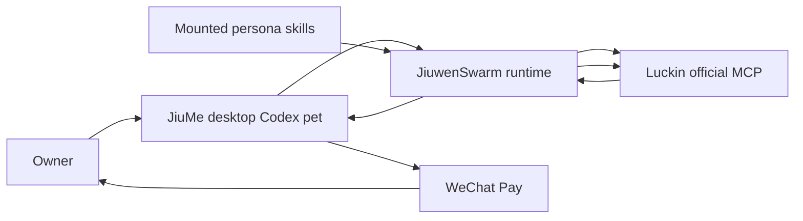

# JiuMe Luckin Payment Agent Design

Date: 2026-06-29
Status: design approved for implementation planning

## Goal

Build a real "order a Luckin drink" demo in JiuMe:

- The owner says they want a usual Luckin drink.
- JiuMe uses a food servant and payment servant flow.
- JiuwenSwarm calls Luckin's official AI Open Platform / MCP to find stores, choose products, preview the order, create the order, and query status.
- JiuMe opens Luckin's returned payment deeplink.
- The owner confirms the actual money movement in WeChat Pay.

This is not a fake merchant demo and not QR-first. If the deeplink cannot open, the flow fails clearly or cancels the pending order.

## Current Repo Fit

JiuMe already has the right minimum pieces:

- Codex pet avatar rendering is now atlas based.
- `TwinStore` has `allowedSkillIds`, `defaultMode`, and `deniedToolCategories`.
- The default denied categories already include `payment`.
- Personal distillation can create and install mounted skills.
- `runtime/context.py` injects mounted skill context into `chat.send`.
- Desktop already maps `chat.ask_user_question` to `waiting_approval`.
- Desktop already persists chat/activity history and handles gateway tool events.

So the first implementation should not add a new payment platform. It should add the thinnest Luckin order flow and reuse existing Gateway/tool/event plumbing.

## External Facts Checked

Luckin's official AI Open Platform describes a Streamable HTTP MCP server for AI agents and includes store query, product search, order creation, and order management capabilities.

Relevant official pages:

- https://open.lkcoffee.com/
- https://open.lkcoffee.com/mcp

Observed official MCP/tool surface from the public Luckin site bundle:

- `queryShopList`
- `searchProductForMcp`
- `switchProduct`
- `queryProductDetailInfo`
- `previewOrder`
- `createOrder`
- `queryOrderDetailInfo`
- `cancelOrder`

`createOrder` exposes `payOrderUrl` and `payOrderQrCodeUrl`. The documented example for `payOrderUrl` is a WeChat Pay deeplink shaped like `weixin://wxpay/bizpayurl?...`.

## Target UX

Happy path:

1. Owner: "帮我点一杯常喝的瑞幸".
2. Food servant resolves store, product, SKU, coupon, and order preview.
3. Payment servant checks local rules:
   - merchant is Luckin,
   - amount is under configured limit,
   - store/address is clear,
   - one final user confirmation will happen in WeChat Pay.
4. Runtime calls Luckin `createOrder`.
5. Desktop opens `payOrderUrl`.
6. Owner confirms in WeChat Pay.
7. Runtime polls `queryOrderDetailInfo`.
8. JiuMe shows paid status, pickup code, store, amount, and next step.

No extra JiuMe "confirm payment" card on the happy path. WeChat Pay confirmation is the final confirmation.

Ask the owner before `createOrder` only when the order is ambiguous or out of policy:

- multiple likely products,
- store is unclear,
- amount exceeds limit,
- coupon choice changes price unexpectedly,
- payment URL is missing,
- Luckin returns an error,
- token/session is invalid.

## Architecture

Keep the existing shape:



Servants are a routing/persona layer first, not separate desktop processes:

- `food-servant-luckin`: resolves drink preference, store, SKU, coupon, order preview.
- `payment-servant-guardian`: enforces policy, opens the payment deeplink, polls order status.
- 衣/住/行 servants can remain simulated personal skills until they have a real provider.

## Minimal Data

Do not introduce a payment database in v1. Persist a small local audit record under the active twin:

```json
{
  "provider": "luckin-mcp",
  "merchant": "luckin",
  "orderId": "7639308439653908490",
  "status": "pending_payment",
  "amount": 16,
  "store": "AI点单专用",
  "items": ["耶加雪菲拿铁"],
  "createdAt": "2026-06-29T00:00:00Z",
  "updatedAt": "2026-06-29T00:00:00Z"
}
```

The audit record must not contain the Luckin bearer token, phone number, WeChat credentials, payment password, or full payment URL if that URL contains sensitive material. Store a redacted URL fingerprint if needed.

## Secret Handling

The Luckin token is local runtime configuration only:

- Use an environment variable such as `JIUME_LUCKIN_MCP_TOKEN`.
- Never commit it.
- Never write it to the twin profile, personal skill text, audit logs, docs, test snapshots, or screenshots.
- Mask it in errors and debug output.

## Implementation Plan

Lazy first slice:

1. Add one local Luckin MCP client wrapper or configure JiuwenSwarm to call Luckin MCP directly if existing MCP config is enough.
2. Add one JiuMe "Luckin order" skill card/persona route.
3. Add one payment guard helper that decides whether to proceed, ask, cancel, or fail.
4. Add desktop handling for a trusted `payOrderUrl` artifact/action:
   - open only `weixin://wxpay/...` from Luckin order results,
   - record activity,
   - start polling order status.
5. Add tests for:
   - token redaction,
   - guard decisions,
   - no QR default,
   - deeplink open action,
   - status mapping.

Skipped for v1:

- true multi-window servant desktop processes,
- a generic payment platform,
- QR payment as the main experience,
- Alipay for Luckin unless Luckin's official MCP returns an Alipay payment deeplink,
- browser/mobile reverse engineering.

## Real Verification Requirement

Before calling the implementation done, run a real end-to-end Luckin test with the owner-provided token in local environment only:

1. Query nearby Luckin stores.
2. Search/select one drink.
3. Preview the order.
4. Create a real pending order.
5. Open `payOrderUrl` as a WeChat Pay deeplink.
6. The owner confirms or cancels in WeChat.
7. Query order status.
8. If unpaid/cancelled, call `cancelOrder` when allowed.
9. Record redacted evidence:
   - tool names called,
   - order id suffix only,
   - amount,
   - status transitions,
   - whether deeplink opened,
   - no token and no payment secret.

If the real Luckin payment requires a mobile-only WeChat confirmation that cannot be automated from desktop, that is acceptable: the success criterion is that JiuMe creates the real Luckin order and opens the official payment deeplink; the money confirmation remains in WeChat.
