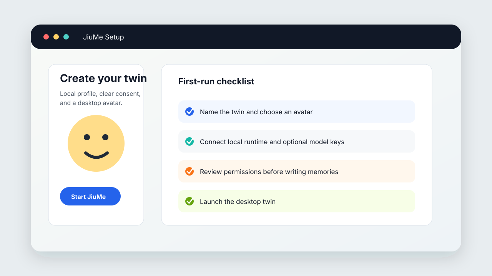
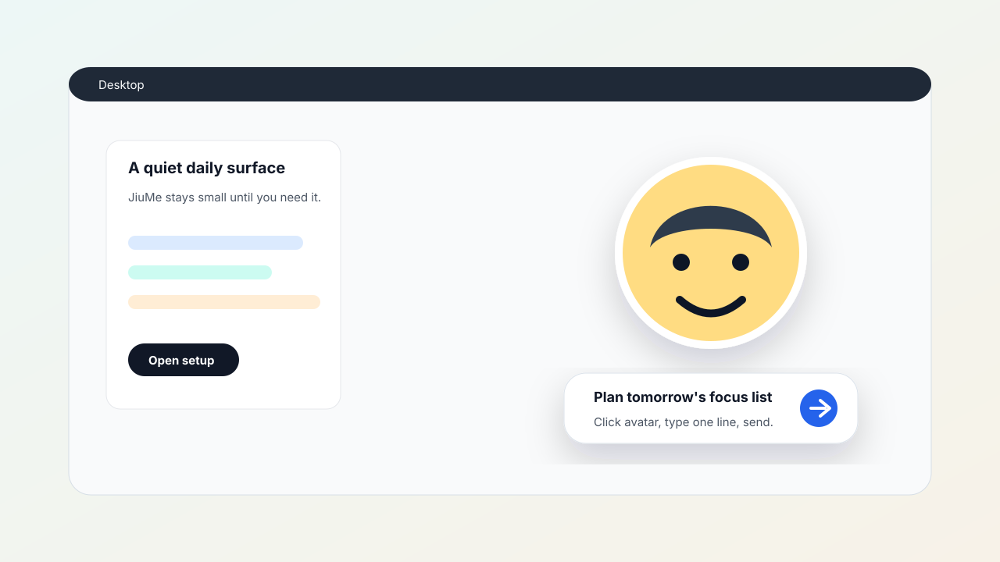
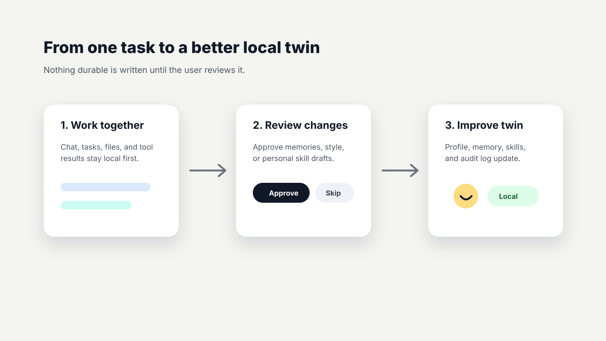

# JiuMe 实用指南

JiuMe 是个人 Agent 的桌面层。它的日常界面刻意保持很轻：一个桌面头像、一个一句话任务入口，以及需要你审阅后才会持久写入的本地分身数据。



## 第一次运行

```bash
git clone https://github.com/XiaoLuoLYG/jiume.git
cd jiume

uv venv --python 3.11 --seed .venv
uv pip install -e ".[test]"

.venv/bin/jiume-launch --open-setup
```

新用户优先用这一条启动命令。它会同时启动 Setup、本地 JiuwenSwarm Runtime 和桌面头像。

## 日常怎么用

1. 单击头像，输入一句话。
2. 把任务发送给 Agent。
3. 等待 JiuMe 用简短状态展示进度。
4. 对权限、记忆或技能更新进行审阅后，再决定是否保存。

JiuMe 会把 Agent 过程映射成简单状态：idle、thinking、working、waiting approval、success、error 和 sleep。目标是让桌面保持安静，同时让真实 Runtime 在背后工作。



## 常用命令

启动完整本地体验：

```bash
.venv/bin/jiume-launch --open-setup
```

只打开配置页：

```bash
.venv/bin/jiume-setup --open
```

不连接 Gateway，只查看头像 UI：

```bash
.venv/bin/jiume --gateway-url ""
```

安装、查看或移除 macOS 登录启动项：

```bash
.venv/bin/jiume-launch --install-login-item
.venv/bin/jiume-launch --login-item-status
.venv/bin/jiume-launch --uninstall-login-item
```

测试时手动切换头像状态：

```bash
.venv/bin/jiume-state idle
.venv/bin/jiume-state thinking
.venv/bin/jiume-state working
.venv/bin/jiume-state waiting_approval
.venv/bin/jiume-state success
.venv/bin/jiume-state error
.venv/bin/jiume-state sleep
```

## 可选图片服务

图片生成是可选能力。没有配置凭证时，JiuMe 仍会使用本地头像资产打开。

```bash
export JIUME_OPENAI_API_KEY="..."
export JIUME_OPENAI_BASE_URL="https://api.openai.com/v1"
export JIUME_IMAGE_MODEL="gpt-image-2"
export JIUME_IMAGE_PROVIDER="auto"
```

Setup 也可以把这些值保存到 `~/.jiuwenswarm/jiume/config.env`。

## 本地数据

JiuMe 的数据默认在 `~/.jiuwenswarm/jiume/`：

```text
config.env
desktop_state.json
window_state.json
conversation_state.json
companion_state.json
twins/{twin_id}/profile.json
twins/{twin_id}/memory.json
twins/{twin_id}/avatar/
twins/{twin_id}/audit/events.jsonl
twins/{twin_id}/distill/jobs/{job_id}/job.json
```

不要在 issue 或 PR 里上传这个目录。里面可能包含私人身份、聊天、头像和记忆数据。

## JiuMe 如何学习



JiuMe 可以把经过审阅的对话、任务和来源片段转化为：

- profile notes
- communication style
- procedural memory
- personal skill drafts

最重要的规则很简单：个人学习必须先审阅，再持久写入。

## 排障

- 如果头像没有出现，先运行 `.venv/bin/jiume --gateway-url ""` 单独检查 UI。
- 如果 Setup 能打开但任务不跑，重新执行 `.venv/bin/jiume-launch --open-setup`。
- 如果测试或命令状态混乱，可以先设置临时 `JIUWENSWARM_DATA_DIR`，用干净数据目录重启。
- 报告 bug 时请带上命令、macOS/Python 版本和可见错误，并遮盖密钥和个人数据。

## 验证

```bash
.venv/bin/python -m compileall -q jiume jiuwenswarm/start_services.py
.venv/bin/python -m pytest -q --no-cov tests/unit_tests/jiume
git diff --check
```
